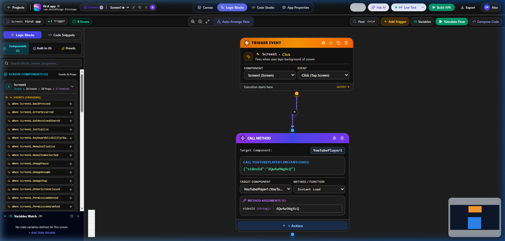
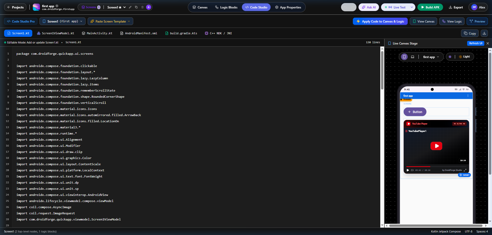
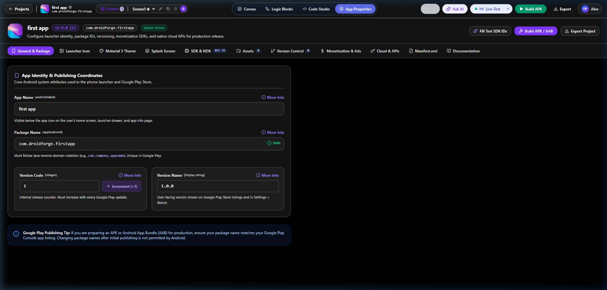
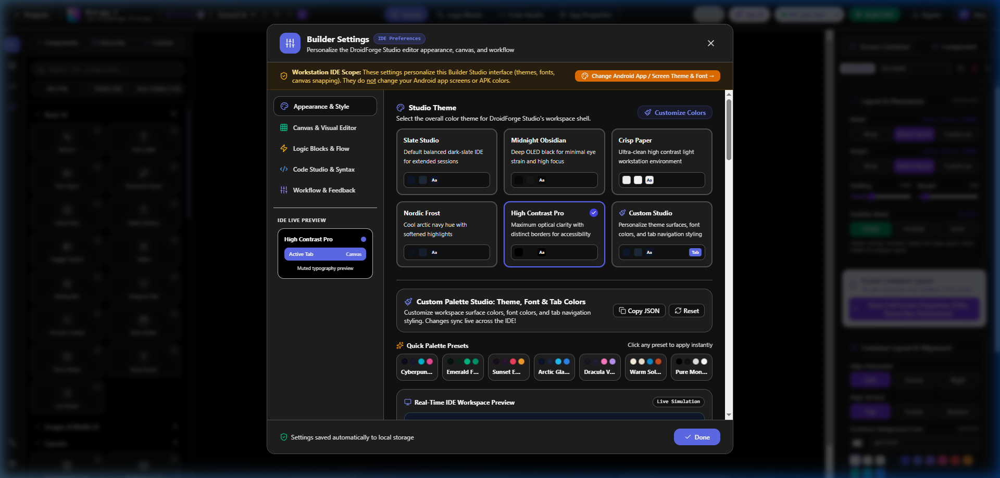

# 🚀 DroidForge Studio - Visual Android App Builder Testing & Feature Guide
*(Guide in Roman Urdu & English)*

Aap ka friend ya koi bhi user DroidForge Studio ko kitni aasani se apne PC par setup karke test kar sakta hai, niche diye gaye steps aur UI screens ko follow karein:

---

## 📸 Builder Features & UI Screenshots Tour (9 Key Features)

### 1. 🚀 App Creation & Dashboard
Pehla step app create karne ka setup modal:


### 2. 🎨 Main Visual Builder Canvas
Component palette se components drag-and-drop karein aur properties custom change karein:


### 3. 🌲 Component Layout Hierarchy
Apne screen ke tamaam components node hierarchy tree mein dekhein aur re-order karein:


### 4. 🧩 Custom Component Studio & Jetpack Compose
Custom Kotlin Compose components create aur live preview karein:


### 5. 🤖 Gemini AI Android Studio Architect
AI se kisi bhi kisam ki Android screen prompt likh kar automatic generate karwayein:


### 6. ⚡ Visual Logic Flow Node Editor
Event triggers (`OnClick`, `OnCreate`) ko Actions (`Method Call`, `Toasts`, `Firebase`) se visual nodes dwara connect karein:



### 7. 💻 Code Studio & Jetpack Compose Live Preview
Clean Kotlin Jetpack Compose code dekhein aur edit karein side-by-side live phone stage preview ke saath:



### 8. 🏷️ App Identity & Publishing Properties
App Name, Package Name, Version Code, Launcher Icon, Splash Screen, aur SDK settings configure karein:



### 9. 🎨 Builder IDE Appearance & Themes
DroidForge Studio ka dark theme and IDE colors customize karein (Midnight Obsidian, High Contrast Pro, Nordic Frost):



---

## 📋 Prerequisites (Requirements)
1. **Node.js**: Phone / PC par app builder run karne ke liye Node.js installed hona chahiye.
   - Download link: [https://nodejs.org/](https://nodejs.org/) (Download **LTS Version**)
2. **Web Browser**: Google Chrome, Edge, ya Brave browser.

---

## 🛠️ Step 1: Install & Run on Localhost (PC par Chalanay Ka Tarika)

### Tarika 1: Double-Click Batch File (Sab Se Aasan Method)
1. Project folder open karein.
2. `START_STUDIO.bat` file par **Double Click** karein.
3. Pehli baar yeh dependencies automatic install karega (`npm install`).
4. Terminal mein jab yeh message aaye:
   `DroidForge Server running on http://0.0.0.0:3000`
5. Apne browser mein open karein: **`http://localhost:3000`**

### Tarika 2: Command Prompt / Terminal Se
1. Project folder mein Command Prompt (CMD) ya Terminal open karein.
2. Niche di gayi commands run karein:
   ```bash
   npm install
   npm run dev
   ```
3. Browser mein open karein: **`http://localhost:3000`**

---

## 📱 Step 2: Phone Par App Test Karne Ke 3 Tarike (Mobile Testing)

DroidForge Studio mein aap 3 simple tarikon se app ko phone par test kar sakte hain:

### ⚡ Method 1: DroidForge Companion App (Live Sync - Recommended)
1. Studio Header mein **"Download Companion APK"** par click karein.
2. App ko apne Android Phone par install karein.
3. Phone par Companion App open karein aur Studio ka **QR Code scan karein** (ya Sync Code enter karein).
4. **Fayda**: PC par jab bhi aap UI ya Logic change karenge, phone par **Live Real-time update** dikhega!

### 📦 Method 2: Compile & Build Real Native APK File
1. Studio Header mein **"Build APK"** button par click karein.
2. Studio backend project ko compile karke real **`.apk`** build karega.
3. Build complete hone par **"Download APK"** button aayega ya QR Code scan karke APK phone par download karke install kar lein!

### 🌐 Method 3: Mobile Browser Live Preview
1. PC aur Phone ko **SAME Wi-Fi** se connect karein.
2. PC par Command Prompt khol kar `ipconfig` likhein aur apna local IP address dekhein (e.g., `192.168.1.10`).
3. Phone browser par open karein: **`http://192.168.1.10:3000`**

---

Happy Testing with DroidForge Studio! 🚀
