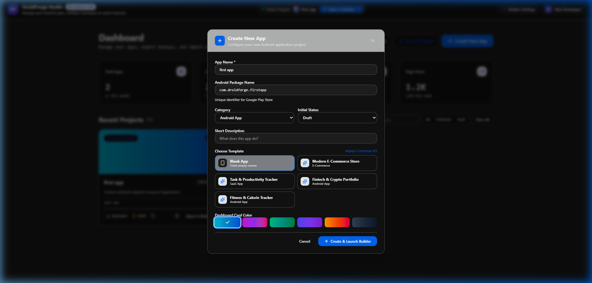
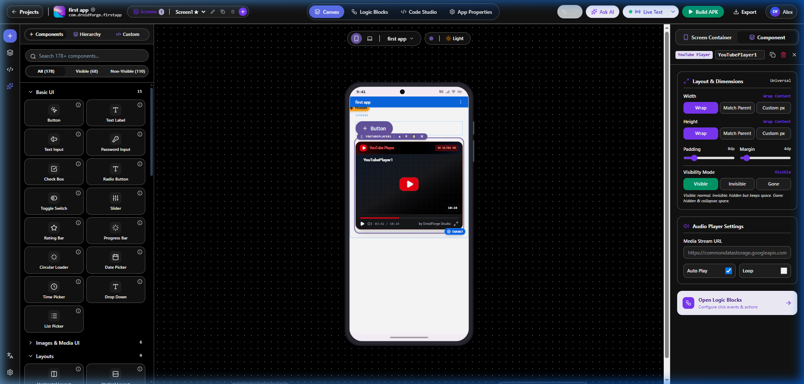
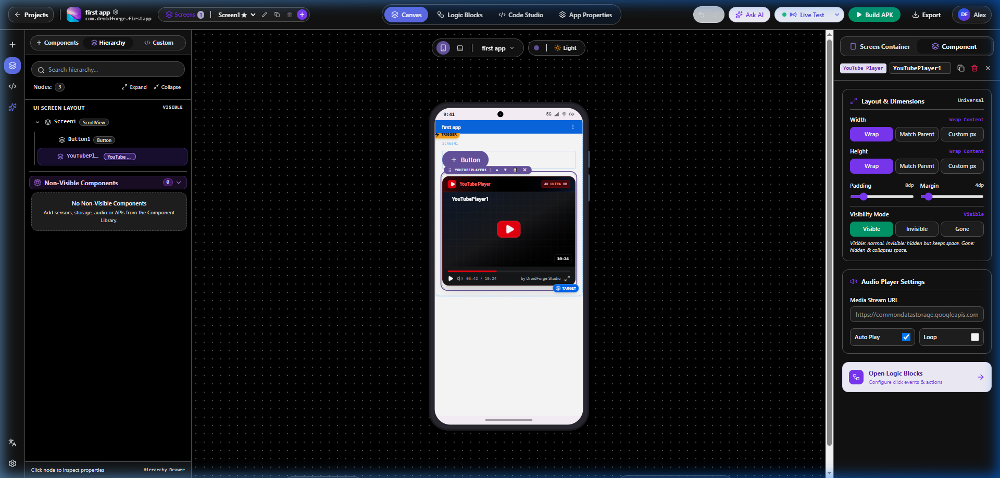
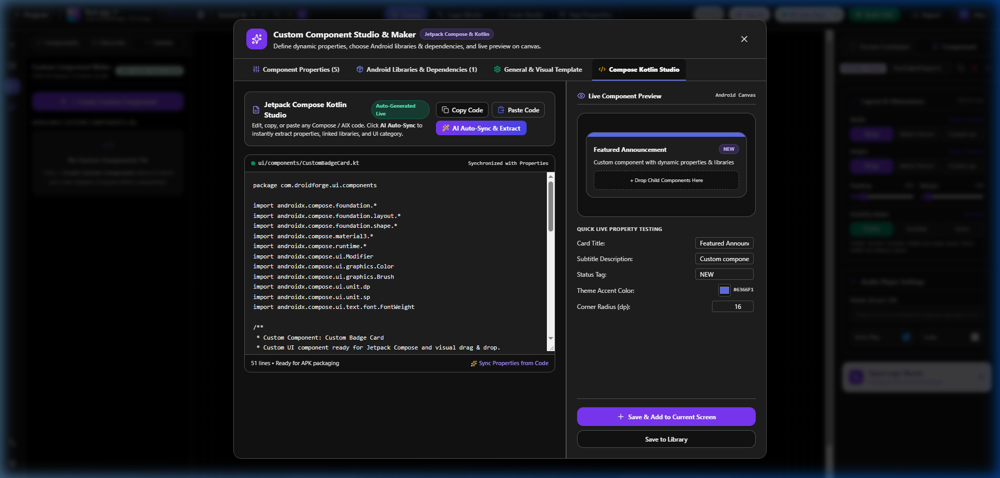
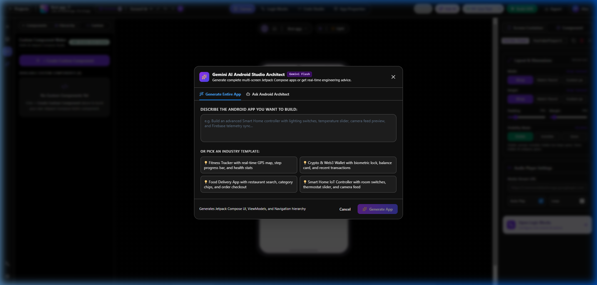

# 🛠️ DroidForge Studio - Visual Android App Builder

[](https://github.com/Adnan10p/droidforge-studio)
[]()
[]()

**DroidForge Studio** is a modern visual drag-and-drop IDE, low-code platform, and native APK builder for Android application development created by **[@Adnan10p](https://github.com/Adnan10p)**. It allows developers, designers, and non-coders to visually design Android interfaces, attach visual block logic, preview in real-time, generate full UI screens using AI, and compile native Android APK binaries directly for mobile devices.

---

## 📸 Visual Showcase & Interface Tour

### 1. 🚀 App Creation & Template Dashboard
Easily configure your new Android application project, set unique package identifiers (`com.droidforge.app`), select industry starter templates (E-Commerce, Productivity, Fintech, Fitness), and choose custom dashboard theme colors.



---

### 2. 🎨 Main Visual Builder Canvas & Component Palette
Drag-and-drop from over 170+ Material 3 Android components (Buttons, Inputs, Sliders, Cards, YouTube Player, Maps, Camera). Inspect and fine-tune layout dimensions, padding, margins, visibility modes, and alignment on the real-time phone preview.



---

### 3. 🌲 Component Layout Hierarchy Tree
Inspect the complete screen node tree in real-time. Expand, collapse, re-order, and manage visible/non-visible background components (Sensors, Audio Player, Storage, APIs) with instant canvas highlighting.



---

### 4. 🧩 Custom Component Studio & Jetpack Compose Maker
Write custom Jetpack Compose Kotlin code directly inside Studio or let the AI extract dynamic component properties. Includes live live-property testing and dynamic canvas component registration.



---

### 5. 🤖 Gemini AI Android Studio Architect
Describe any Android application idea in plain English (e.g., *"Build a Smart Home controller with lighting switches and camera feed"*), or choose preset templates. The AI automatically generates full Jetpack Compose screens, ViewModels, and visual block logic!



---

## 📥 Installation & Setup Guide (GitHub Clone)

### 1️⃣ Clone the Repository
Open Command Prompt, PowerShell, or Terminal and run:
```bash
git clone https://github.com/Adnan10p/droidforge-studio.git
cd droidforge-studio
```

---

### 2️⃣ Run the App (2 Options)

#### ⚡ Option A: 1-Click Launch (Windows)
Double-click `START_STUDIO.bat` in the project root folder. It will automatically install missing dependencies and launch the server on **`http://localhost:3000`**.

#### 💻 Option B: Manual Command Line Launch
1. Ensure **Node.js** (LTS version) is installed: [https://nodejs.org/](https://nodejs.org/)
2. Install dependencies:
   ```bash
   npm install
   ```
3. Start local server:
   ```bash
   npm run dev
   ```
4. Open in browser: **`http://localhost:3000`**

---

## 📱 How to Test Built Apps on Your Mobile Phone

For step-by-step details in Roman Urdu & English, read [FRIEND_TESTING_GUIDE.md](file:///c:/Users/SAAB%20PC/Desktop/droidforge-studio---visual-android-app-builder%20%281%29/FRIEND_TESTING_GUIDE.md).

1. **⚡ Companion Live Sync (Instant Preview)**:
   - Download the **Companion APK** directly from the top bar in DroidForge Studio.
   - Install on your phone, scan the QR code displayed on Studio, and watch your visual UI and logic changes sync live in real-time!
2. **📦 Native APK Compilation**:
   - Click **"Build APK"** in the Studio header to compile a native Android `.apk` binary file.
   - Download and install `.apk` on any Android smartphone.
3. **🌐 Mobile Browser Live Receiver**:
   - Connect phone & PC to same Wi-Fi network and open `http://<YOUR_PC_IP>:3000` in your phone browser.

---

## 👤 Author & Support
Created by **Adnan** ([@Adnan10p](https://github.com/Adnan10p)).
Feel free to star ⭐️ the repository and test it out!
